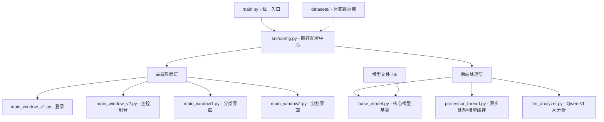

# 脑肿瘤 AI 辅助诊断系统 - 项目结构报告

## 项目概述
本项目是一个基于深度学习的脑肿瘤 AI 辅助诊断系统，集成了**肿瘤分类**和**肿瘤分割**两大核心功能。系统采用 PyQt5 构建现代化 GUI 界面，结合 TensorFlow/Keras 深度学习框架，并引入 Qwen-VL 大模型进行多模态影像分析。

## 项目架构

### 整体架构图


## 目录结构
```text
MIMIR-MedVision-Navigator/
├── datasets/                   # 外部化数据集目录 (与 src 同级)
│   ├── test_images/            # 测试 MRI 图像
│   ├── test_masks/             # 测试掩码 (Ground Truth)
│   ├── test_results/           # 推理结果输出 (含 masks, visualizations, info)
│   └── cnn_images/             # CNN 分类测试数据集
├── src/                        # 源代码根目录
│   ├── main.py                 # 程序启动入口
│   ├── config.py               # 【核心】全局路径与配置中心
│   ├── back/                   # 后端逻辑层
│   │   ├── base_model.py       # 【核心】统一模型加载与损失函数 (DRY原则)
│   │   ├── model_utils.py      # 图像处理与可视化工具
│   │   ├── processor_thread.py # 图像处理线程 (含模型缓存机制)
│   │   ├── llm_analyzer.py     # 大模型 AI 影像分析
│   │   └── CNN/                # 分类模块专用逻辑
│   └── front/                  # 前端界面层
│       ├── main_window_v1.py   # 登录页面
│       ├── main_window_v2.py   # 仪表盘控制台
│       ├── main_window1.py     # 肿瘤分类 Viewer
│       └── main_window2.py     # 肿瘤分割 Viewer
├── docs/                       # 项目文档
└── requirements.txt            # 环境依赖
```

## 核心设计模式

### 1. 路径中心化管理 (`config.py`)
- **设计初衷**：解决硬编码路径导致的迁移困难。
- **功能**：自动计算项目根目录，通过 `PATHS` 字典统一管理 `datasets` 外部目录及内部模型路径。

### 2. 模型逻辑解耦 (`base_model.py`)
- **设计初衷**：消除 `model_utils.py` 与 `pre_size.py` 之间的代码冗余。
- **功能**：统一封装 `dice_coef`, `dice_loss`, `iou_metric` 等自定义指标，提供标准化的 `load_tumor_model` 接口。

### 3. 模型缓存机制 (`processor_thread.py`)
- **设计初衷**：避免每次推理重复加载数兆字节的模型文件。
- **功能**：在 `ImageProcessorThread` 中引入类静态变量 `_cached_model`，实现模型的一次加载、多次复用，显著提升系统响应速度。

## 核心功能模块

### 1. 前端层 (Front-end)
- **多窗口调度**：采用信号/槽机制实现从登录页到主控制台，再到功能页面的平滑跳转。
- **交互增强**：`ZoomableImageLabel` 支持 MRI 影像的实时缩放、平移及坐标跟踪。

### 2. 后端层 (Back-end)
- **U-Net 分割**：像素级定位肿瘤区域，生成概率热图与掩码叠加图。
- **CNN 分类**：对四类脑肿瘤进行高精度识别（准确率 99.1%）。
- **LLM 语义分析**：调用 Qwen-VL 接口，基于影像形态给出临床级别的阶段判断与后果分析。

## 部署与配置
- **环境要求**：Python 3.8+, TensorFlow 2.x, PyQt5.
- **数据迁移**：确保数据集位于项目根目录下的 `datasets/` 中。
- **API 配置**：需设置环境变量 `DASHSCOPE_API_KEY` 以启用 AI 分析功能。